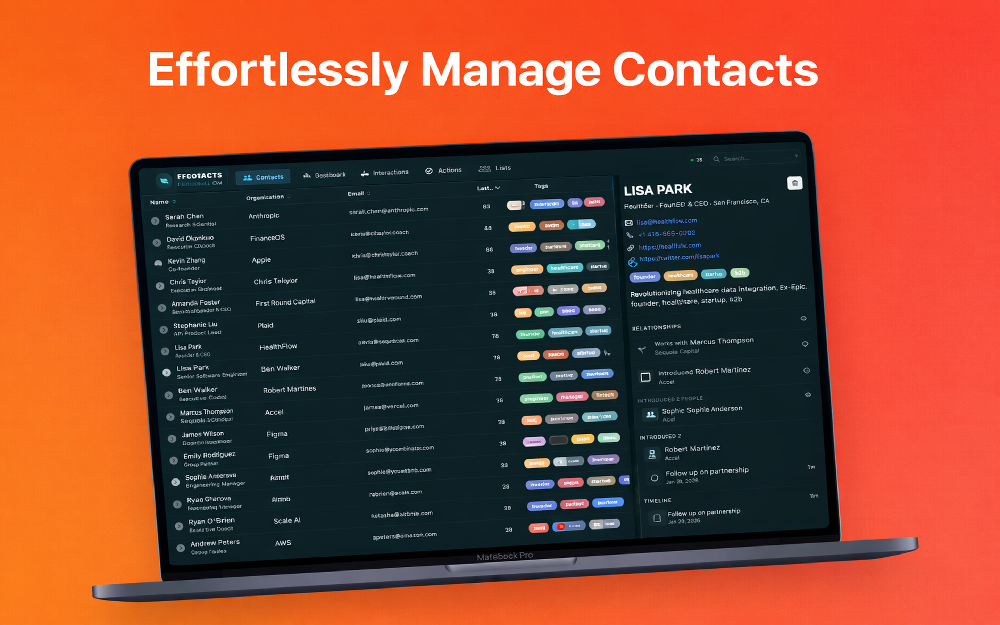
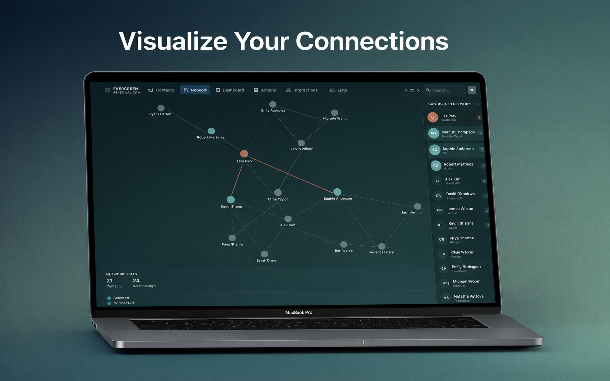
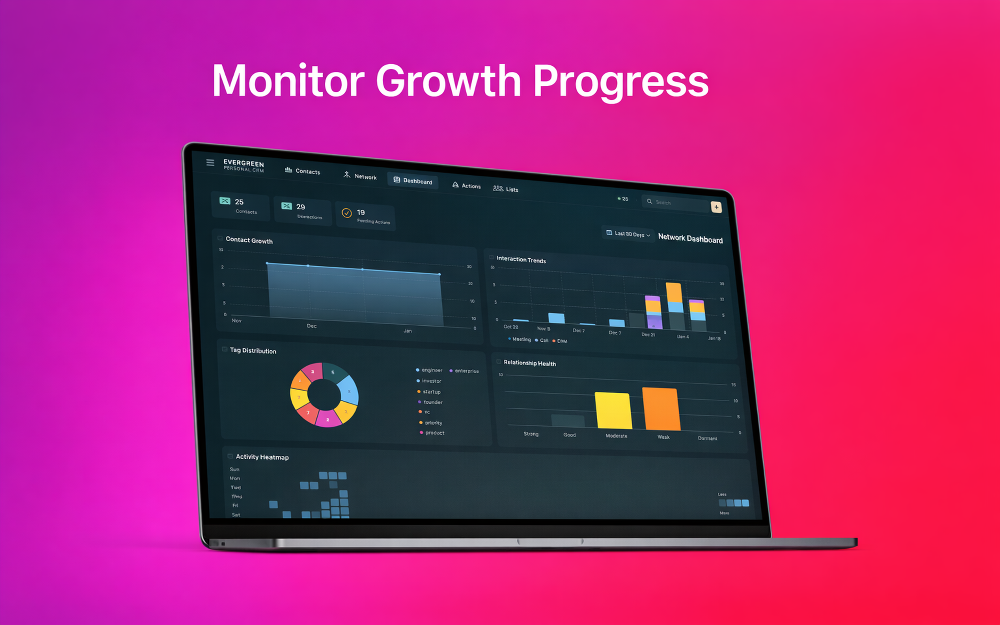
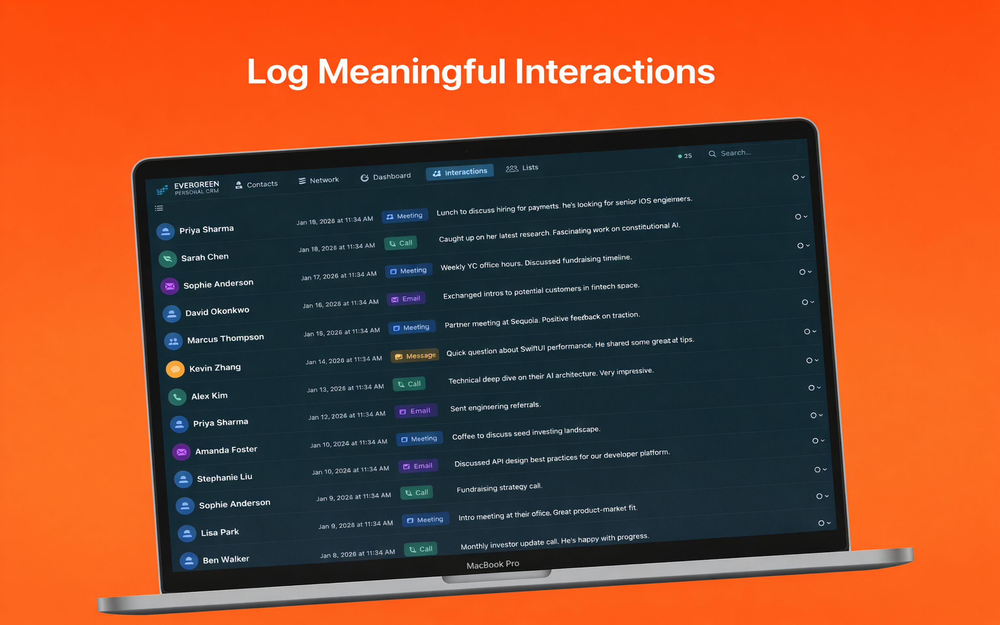
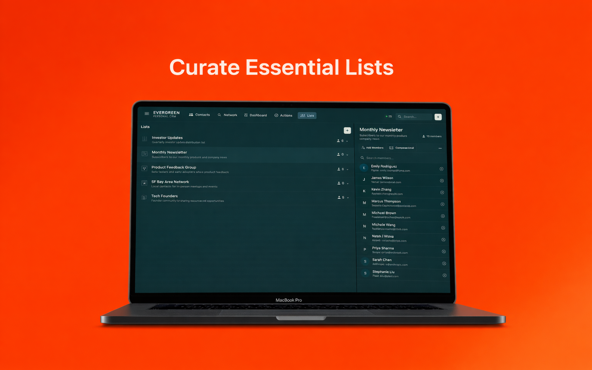

<p align="center">
  
</p>

<h1 align="center">Evergreen</h1>

<p align="center">
  <strong>The local-first personal CRM for macOS — with AI superpowers.</strong>
</p>

<p align="center">
  <a href="https://apps.apple.com/us/app/evergreencrm/id6753191506?mt=12">Download on the Mac App Store</a> &nbsp;|&nbsp;
  <a href="https://heltonlabs.com/evergreen">Learn More</a>
</p>

---

Your contacts, your Mac, your data. [Evergreen](https://heltonlabs.com/evergreen) is a blazing-fast personal CRM that keeps everything local — no cloud, no subscriptions, no telemetry. Just a beautiful native Mac app with a built-in AI agent interface that lets Claude manage your relationships alongside you.

This repository contains **18 Claude Code skills** that turn Evergreen into an AI-powered relationship management system. Install them and Claude can capture contacts, draft follow-ups, prep you for meetings, scan your inbox, analyze your network, and more — all reading and writing directly to your local Evergreen database.

<p align="center">
  <a href="https://apps.apple.com/us/app/evergreencrm/id6753191506?mt=12">
    
  </a>
</p>

## Why Evergreen?

Every CRM is designed for salespeople. Evergreen is designed for **you** — someone who wants to keep track of the people in their life without drowning in enterprise software.

- **Local-first** — Your data lives in a single SQLite file on your Mac. No accounts, no cloud sync, no data leaving your machine.
- **Keyboard-first** — Navigate thousands of contacts at the speed of thought. `⌘K` to search, `⌘N` to create, arrow keys to fly through your network.
- **AI-native** — A built-in [MCP server](https://heltonlabs.com/evergreen) lets Claude (and other AI agents) read and write your contacts, interactions, actions, and relationships directly. Every agent action is attributed and logged.
- **Buy once, own forever** — No subscriptions. No feature gates. No upsells.

<p align="center">
  <a href="https://apps.apple.com/us/app/evergreencrm/id6753191506?mt=12">
    
  </a>
</p>

## What You Get

**Contacts & Relationships** — An information-dense contacts table with resizable columns, inline editing, stackable filters, and a detail pane with Markdown notes, interaction timelines, and relationship mapping. Powerful search tokens let you filter by tag, org, email domain, location, or interaction recency.

**Network Visualization** — See how your contacts are connected to each other. Track who introduced whom, find bridge contacts between clusters, and identify your most valuable connectors.

<p align="center">
  <a href="https://apps.apple.com/us/app/evergreencrm/id6753191506?mt=12">
    
  </a>
</p>

**Dashboard & Analytics** — Contact growth charts, interaction trends, tag distribution, and a relationship heatmap. See which relationships are thriving and which need attention at a glance.

**Actions & Follow-Ups** — Track next actions with due dates and priorities. Never forget a promised introduction, a follow-up email, or an important check-in.

<p align="center">
  <a href="https://apps.apple.com/us/app/evergreencrm/id6753191506?mt=12">
    
  </a>
</p>

**Interaction History** — Log meetings, calls, emails, and DMs with full context. See your complete relationship timeline at a glance and never walk into a conversation unprepared.

<p align="center">
  <a href="https://apps.apple.com/us/app/evergreencrm/id6753191506?mt=12">
    
  </a>
</p>

**Lists** — Organize contacts into named lists for newsletters, update groups, event invites, or any custom grouping. Batch operations make it easy to log interactions or compose emails for entire lists.

<p align="center">
  <a href="https://apps.apple.com/us/app/evergreencrm/id6753191506?mt=12">
    
  </a>
</p>

## AI-Powered CRM with Claude Code Skills

These skills teach Claude how to work with your Evergreen database. Once installed, Claude automatically uses them when you ask about contacts, follow-ups, meetings, or your network.

### Example Prompts

```
"I just met these people at the conference — add them to Evergreen"
"Who do I need to follow up with this week?"
"Prep me for my call with Sarah Chen"
"Process my meeting notes from today"
"How healthy is my network right now?"
"Draft a re-engagement email to Marcus"
"Scan my inbox and update Evergreen with anything I missed"
"Any news about my top contacts?"
```

### Available Skills

| Skill | Description | Gmail? |
|-------|-------------|--------|
| **[capturing-contacts-in-evergreen](skills/contact-capture/)** | Parse unstructured text into CRM contacts | |
| **[enriching-evergreen-contacts](skills/contact-enrichment/)** | Web-research contacts and fill in missing details | |
| **[evergreen-follow-up-reminders](skills/follow-up-reminders/)** | Generate prioritized follow-up lists | |
| **[drafting-evergreen-follow-ups](skills/draft-follow-up/)** | Draft personalized follow-up messages | |
| **[re-engaging-evergreen-contacts](skills/re-engagement/)** | Find and re-engage dormant contacts | |
| **[drafting-warm-introductions](skills/warm-introduction/)** | Draft double-opt-in introduction emails | |
| **[scanning-inbox-for-evergreen](skills/inbox-scan/)** | Scan Gmail for action items mapped to contacts | Yes |
| **[auto-logging-email-interactions](skills/auto-log-interactions/)** | Sync Gmail activity to Evergreen interaction history | Yes |
| **[evergreen-meeting-prep](skills/meeting-prep/)** | Pre-meeting briefings with full contact context | |
| **[processing-meeting-notes-for-evergreen](skills/post-meeting-notes/)** | Process raw notes into CRM records and actions | |
| **[evergreen-event-follow-up](skills/event-follow-up/)** | Batch-process contacts from events and conferences | |
| **[evergreen-context-recall](skills/context-recall/)** | "Refresh my memory" narrative summaries | |
| **[evergreen-relationship-health](skills/relationship-health/)** | Score and surface relationship health across your network | |
| **[evergreen-network-analysis](skills/network-analysis/)** | Analyze clusters, bridges, and introduction chains | |
| **[evergreen-weekly-report](skills/weekly-report/)** | Weekly relationship management digest | |
| **[evergreen-stale-data-audit](skills/stale-data-audit/)** | Find and fix stale or incomplete contact data | |
| **[evergreen-life-event-tracker](skills/life-events/)** | Track and act on birthdays, job changes, milestones | |
| **[evergreen-news-alerts](skills/news-alerts/)** | Monitor news about contacts and their companies | |

## Installing the Skills

### Via Claude Code Marketplace (Recommended)

```
/plugin marketplace add wdm0006/evergreen-skills
```

Then install the complete set or a specific bundle:

```
# Everything
/plugin install evergreen-complete@wdm0006-evergreen-skills

# Just the daily drivers
/plugin install evergreen-essentials@wdm0006-evergreen-skills

# Gmail integration skills
/plugin install evergreen-email@wdm0006-evergreen-skills

# Relationship nurturing skills
/plugin install evergreen-networking@wdm0006-evergreen-skills

# Monitoring and maintenance skills
/plugin install evergreen-reporting@wdm0006-evergreen-skills
```

### Manual Installation

```bash
git clone https://github.com/wdm0006/evergreen-skills.git
mkdir -p ~/.claude/skills
cp -r evergreen-skills/skills/* ~/.claude/skills/
```

### Verify

```
/plugin list
```

> **Note:** Skills require Claude Code Pro, Max, Team, or Enterprise.

## Plugin Bundles

| Bundle | Skills | For |
|--------|--------|-----|
| **evergreen-complete** | All 18 | Everything |
| **evergreen-essentials** | Contact capture, follow-up reminders, draft follow-up, context recall, meeting prep | Daily use |
| **evergreen-email** | Inbox scan, auto-log interactions, draft follow-up, re-engagement | Gmail integration |
| **evergreen-networking** | Event follow-up, warm intros, network analysis, relationship health, life events | Building relationships |
| **evergreen-reporting** | Weekly report, stale data audit, relationship health, news alerts | Staying on top of things |

## Setting Up Evergreen's MCP Server

[Download Evergreen from the Mac App Store](https://apps.apple.com/us/app/evergreencrm/id6753191506?mt=12), then add the MCP server to your Claude settings:

```json
{
  "mcpServers": {
    "evergreen-crm": {
      "command": "/Applications/Evergreen.app/Contents/MacOS/evergreen-mcp"
    }
  }
}
```

The MCP server runs locally — no network requests, no API keys, no setup beyond this one config line. Claude gets full read/write access to your contacts, interactions, actions, relationships, and activity log. Every agent action is attributed and fully auditable.

If you have **Gmail connected in Claude** (via Google Workspace MCP or Claude's built-in Gmail integration), the email skills can scan your inbox and sync activity to Evergreen automatically.

## Read More

- [Vibe Coding a Personal CRM in Swift](https://mcginniscommawill.com/posts/2025-09-05-vibe-coding-personal-crm/) — How Evergreen was built from scratch in 12 hours
- [Evergreen Gets Serious: Building Tools That Think With You](https://mcginniscommawill.com/posts/2025-10-08-evergreen-gets-serious/) — MCP integration, keyboard shortcuts, and data model expansion
- [Evergreen Gets Even Evergreener](https://mcginniscommawill.com/posts/2026-01-26-evergreen-gets-even-evergreener/) — Network visualization, analytics dashboard, and relationship mapping

## Contributing

Contributions are welcome! Please open an issue or PR on [GitHub](https://github.com/wdm0006/evergreen-skills).

## License

MIT License - see [LICENSE](LICENSE) for details.

---

<p align="center">
  <a href="https://apps.apple.com/us/app/evergreencrm/id6753191506?mt=12"><strong>Get Evergreen on the Mac App Store</strong></a>
  <br>
  Built by <a href="https://heltonlabs.com/evergreen">Helton Labs</a>
</p>
