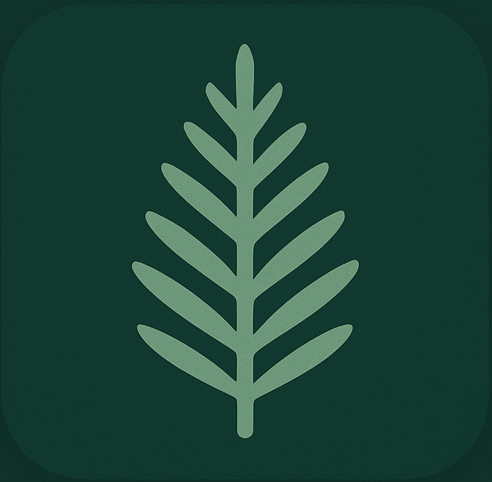
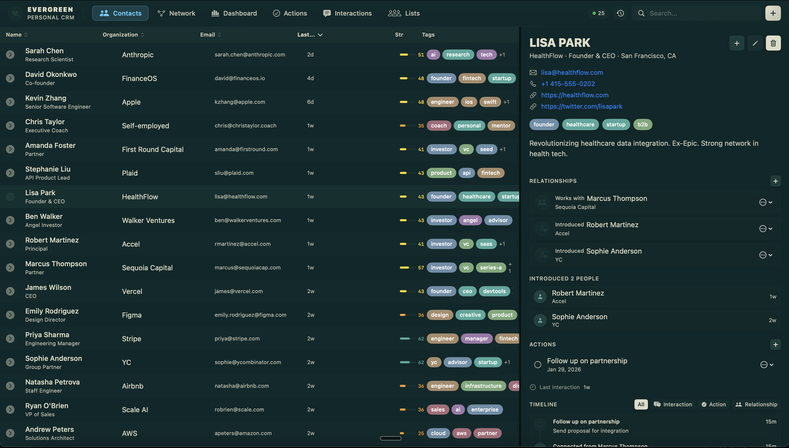
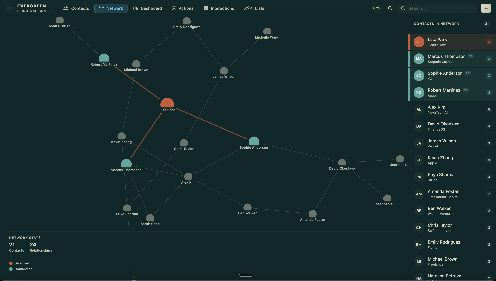
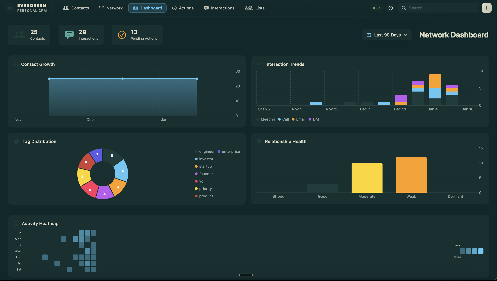
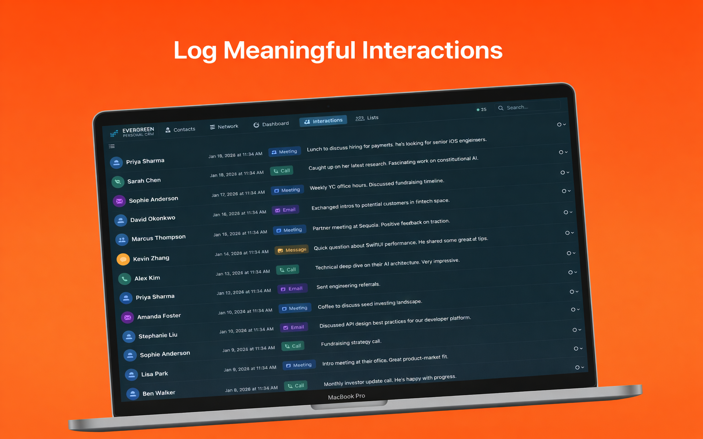
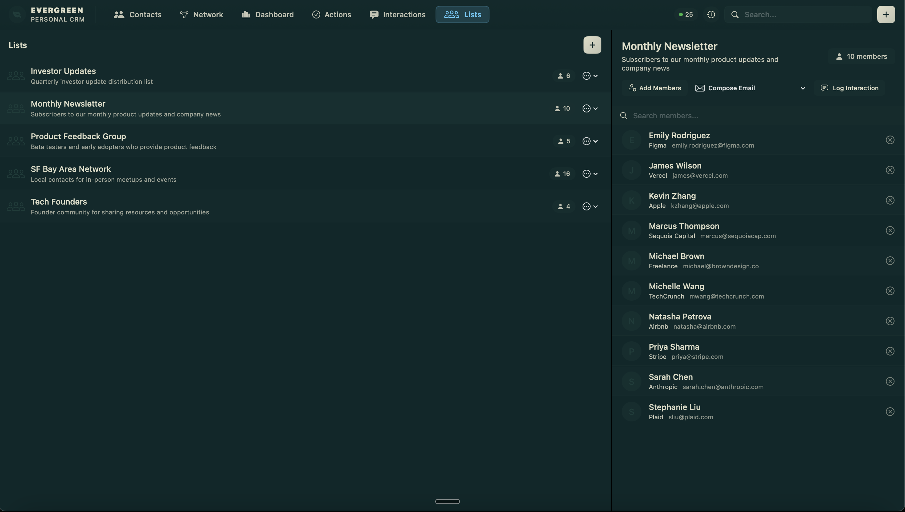

<p align="center">
  
</p>

<h1 align="center">Evergreen</h1>

<p align="center">
  <strong>A local-first personal CRM for Mac, iPhone, and iPad — with AI superpowers.</strong>
</p>

<p align="center">
  <a href="https://apps.apple.com/us/app/evergreencrm/id6753191506">Download on the App Store</a> &nbsp;|&nbsp;
  <a href="https://heltonlabs.com/evergreen">Learn More</a>
</p>

---

Your contacts, your devices, your data. [Evergreen](https://heltonlabs.com/evergreen) is a fast personal CRM for Mac, iPhone, and iPad. There is no Evergreen account and no server of ours holding your contacts — the app stores them on your device, and optional Evergreen Sync mirrors them across your devices through your own iCloud. No ads, no tracking, no telemetry. On the Mac it ships a built-in AI agent interface that lets Claude manage your relationships alongside you.

This repository contains **18 Claude Code skills** that turn Evergreen into an AI-powered relationship management system. Install them and Claude can capture contacts, draft follow-ups, prep you for meetings, scan your inbox, analyze your network, and more — all reading and writing directly to your local Evergreen database.

<p align="center">
  <a href="https://apps.apple.com/us/app/evergreencrm/id6753191506">
    
  </a>
</p>

## Before you install

These skills do nothing on their own. They drive the MCP server inside the Evergreen app, so the app comes first.

| You need | Detail |
|----------|--------|
| **Evergreen for Mac** | $9.99 on the App Store, covering the Mac, iPhone, and iPad app. The MCP server these skills call is part of the Mac app; the iPhone and iPad apps do not run it. |
| **Claude Code** | On a paid plan: Pro, Max, Team, or Enterprise. |
| **Gmail connected in Claude** | Optional. Only the two email skills (inbox scan and auto-log interactions) use it. |

Evergreen Sync is a separate, optional subscription — $1.99 per month — that mirrors your CRM across your own devices through your own iCloud. The skills work without it.

The skills are free and MIT licensed. They are not a standalone product: with no Evergreen app installed there is nothing for them to read.

## Why Evergreen?

Every CRM is designed for salespeople. Evergreen is designed for **you** — someone who wants to keep track of the people in their life without drowning in enterprise software.

- **Local-first** — Your data is stored on your device, not on our servers. There is no Evergreen account and we never see your contacts.

- **Your iCloud, not ours** — Optional Evergreen Sync keeps your network current across your Mac, iPhone, and iPad through your own private iCloud, using Apple's CloudKit. We have no access to it, and the app is fully functional on a single device without it.
- **Keyboard-first** — Navigate thousands of contacts at the speed of thought. `⌘K` to search, `⌘N` to create, arrow keys to fly through your network.
- **AI-native** — A built-in [MCP server](https://heltonlabs.com/evergreen-mcp.html) on the Mac lets Claude (and other AI agents) read and write your contacts, interactions, actions, and relationships directly. Every agent action is attributed and logged.

Evergreen is $9.99 on the App Store, covering the Mac, iPhone, and iPad app. Evergreen Sync is a separate optional subscription — $1.99 per month — and these skills work without it.

<p align="center">
  <a href="https://apps.apple.com/us/app/evergreencrm/id6753191506">
    
  </a>
</p>

## What You Get

**Contacts & Relationships** — An information-dense contacts table with resizable columns, inline editing, stackable filters, and a detail pane with Markdown notes, interaction timelines, and relationship mapping. Powerful search tokens let you filter by tag, org, email domain, location, or interaction recency.

**Network Visualization** — See how your contacts are connected to each other. Track who introduced whom, find bridge contacts between clusters, and identify your most valuable connectors.

<p align="center">
  <a href="https://apps.apple.com/us/app/evergreencrm/id6753191506">
    
  </a>
</p>

**Dashboard & Analytics** — Contact growth charts, interaction trends, tag distribution, and a relationship heatmap. See which relationships are thriving and which need attention at a glance.

**Actions & Follow-Ups** — Track next actions with due dates and priorities. Never forget a promised introduction, a follow-up email, or an important check-in.

<p align="center">
  <a href="https://apps.apple.com/us/app/evergreencrm/id6753191506">
    
  </a>
</p>

**Interaction History** — Log meetings, calls, emails, and DMs with full context. See your complete relationship timeline at a glance and never walk into a conversation unprepared.

<p align="center">
  <a href="https://apps.apple.com/us/app/evergreencrm/id6753191506">
    
  </a>
</p>

**Lists** — Organize contacts into named lists for newsletters, update groups, event invites, or any custom grouping. Batch operations make it easy to log interactions or compose emails for entire lists.

<p align="center">
  <a href="https://apps.apple.com/us/app/evergreencrm/id6753191506">
    
  </a>
</p>

## AI-Powered CRM with Claude Code Skills

These skills teach Claude how to work with your Evergreen database. Once installed, Claude automatically uses them when you ask about contacts, follow-ups, meetings, or your network.

## What you can ask Claude to do

- **Before a meeting** — "Prep me for my call with Sarah Chen."
  `meeting-prep`, `context-recall`
- **After a meeting or an event** — "Process my notes from today." "I just met these people at the conference — add them to Evergreen."
  `post-meeting-notes`, `event-follow-up`, `contact-capture`
- **Keeping in touch** — "Who do I need to follow up with this week?" "Draft a re-engagement email to Marcus."
  `follow-up-reminders`, `draft-follow-up`, `re-engagement`, `life-events`, `news-alerts`
- **Introductions** — draft a double-opt-in introduction between two contacts.
  `warm-introduction`
- **Your inbox** — "Scan my inbox and update Evergreen with anything I missed."
  `inbox-scan`, `auto-log-interactions`
- **Reviewing your network** — "How healthy is my network right now?"
  `weekly-report`, `relationship-health`, `network-analysis`, `stale-data-audit`, `contact-enrichment`

The full list, with each skill's description, is in the table below.

### Example Prompts

```
"I just met these people at the conference — add them to Evergreen"
"Who do I need to follow up with this week?"
"Prep me for my call with Sarah Chen"
"Process my meeting notes from today"
"How healthy is my network right now?"
"Draft a re-engagement email to Marcus"
"Scan my inbox and update Evergreen with anything I missed"
"Any news about my top contacts?"
```

### Available Skills

| Skill | Description | Gmail? |
|-------|-------------|--------|
| **[capturing-contacts-in-evergreen](skills/contact-capture/)** | Parse unstructured text into CRM contacts | |
| **[enriching-evergreen-contacts](skills/contact-enrichment/)** | Web-research contacts and fill in missing details | |
| **[evergreen-follow-up-reminders](skills/follow-up-reminders/)** | Generate prioritized follow-up lists | |
| **[drafting-evergreen-follow-ups](skills/draft-follow-up/)** | Draft personalized follow-up messages | |
| **[re-engaging-evergreen-contacts](skills/re-engagement/)** | Find and re-engage dormant contacts | |
| **[drafting-warm-introductions](skills/warm-introduction/)** | Draft double-opt-in introduction emails | |
| **[scanning-inbox-for-evergreen](skills/inbox-scan/)** | Scan Gmail for action items mapped to contacts | Yes |
| **[auto-logging-email-interactions](skills/auto-log-interactions/)** | Sync Gmail activity to Evergreen interaction history | Yes |
| **[evergreen-meeting-prep](skills/meeting-prep/)** | Pre-meeting briefings with full contact context | |
| **[processing-meeting-notes-for-evergreen](skills/post-meeting-notes/)** | Process raw notes into CRM records and actions | |
| **[evergreen-event-follow-up](skills/event-follow-up/)** | Batch-process contacts from events and conferences | |
| **[evergreen-context-recall](skills/context-recall/)** | "Refresh my memory" narrative summaries | |
| **[evergreen-relationship-health](skills/relationship-health/)** | Score and surface relationship health across your network | |
| **[evergreen-network-analysis](skills/network-analysis/)** | Analyze clusters, bridges, and introduction chains | |
| **[evergreen-weekly-report](skills/weekly-report/)** | Weekly relationship management digest | |
| **[evergreen-stale-data-audit](skills/stale-data-audit/)** | Find and fix stale or incomplete contact data | |
| **[evergreen-life-event-tracker](skills/life-events/)** | Track and act on birthdays, job changes, milestones | |
| **[evergreen-news-alerts](skills/news-alerts/)** | Monitor news about contacts and their companies | |

## Installing the Skills

### Via Claude Code Marketplace (Recommended)

```
/plugin marketplace add wdm0006/evergreen-skills
```

Then install the complete set or a specific bundle:

```
# Everything
/plugin install evergreen-complete@wdm0006-evergreen-skills

# Just the daily drivers
/plugin install evergreen-essentials@wdm0006-evergreen-skills

# Gmail integration skills
/plugin install evergreen-email@wdm0006-evergreen-skills

# Relationship nurturing skills
/plugin install evergreen-networking@wdm0006-evergreen-skills

# Monitoring and maintenance skills
/plugin install evergreen-reporting@wdm0006-evergreen-skills
```

### Manual Installation

```bash
git clone https://github.com/wdm0006/evergreen-skills.git
mkdir -p ~/.claude/skills
cp -r evergreen-skills/skills/* ~/.claude/skills/
```

### Verify

```
/plugin list
```

> **Note:** Skills require Claude Code Pro, Max, Team, or Enterprise.

## Plugin Bundles

| Bundle | Skills | For |
|--------|--------|-----|
| **evergreen-complete** | All 18 | Everything |
| **evergreen-essentials** | Contact capture, follow-up reminders, draft follow-up, context recall, meeting prep | Daily use |
| **evergreen-email** | Inbox scan, auto-log interactions, draft follow-up, re-engagement | Gmail integration |
| **evergreen-networking** | Event follow-up, warm intros, network analysis, relationship health, life events | Building relationships |
| **evergreen-reporting** | Weekly report, stale data audit, relationship health, news alerts | Staying on top of things |

## Setting Up Evergreen's MCP Server

[Download Evergreen from the App Store](https://apps.apple.com/us/app/evergreencrm/id6753191506), then add the MCP server to your Claude settings:

```json
{
  "mcpServers": {
    "evergreen-crm": {
      "command": "/Applications/EvergreenCRM.app/Contents/MacOS/evergreen-mcp.app/Contents/MacOS/evergreen-mcp"
    }
  }
}
```

The MCP server runs locally on your Mac and needs no API key. Your AI client is a separate thing: anything Claude reads from Evergreen goes to the model provider behind your Claude plan, as with any tool, so decide what you ask it to read with that in mind. Claude gets read and write access to your contacts, interactions, actions, relationships, and activity log, and every agent action is attributed and logged.

Setting up a different client (Claude Desktop, Cursor, Windsurf, Zed), or having an agent do it for you? The step-by-step guide is at <https://heltonlabs.com/evergreen-mcp.html>.

If you have **Gmail connected in Claude** (via Google Workspace MCP or Claude's built-in Gmail integration), the email skills can scan your inbox and sync activity to Evergreen automatically.

## Read More

- [Vibe Coding a Personal CRM in Swift](https://mcginniscommawill.com/posts/2025-09-05-vibe-coding-personal-crm/) — How Evergreen was built from scratch in 12 hours
- [Evergreen Gets Serious: Building Tools That Think With You](https://mcginniscommawill.com/posts/2025-10-08-evergreen-gets-serious/) — MCP integration, keyboard shortcuts, and data model expansion
- [Evergreen Gets Even Evergreener](https://mcginniscommawill.com/posts/2026-01-26-evergreen-gets-even-evergreener/) — Network visualization, analytics dashboard, and relationship mapping

## Contributing

Contributions are welcome! Please open an issue or PR on [GitHub](https://github.com/wdm0006/evergreen-skills).

A GitHub Actions workflow validates skill structure and `marketplace.json`
integrity on every push and pull request. To run the same checks locally:

```bash
python3 scripts/validate_skills.py
```

It verifies that every skill referenced by the manifest exists with a
`SKILL.md`, that each `SKILL.md` has valid frontmatter with a `name` and
`description`, and that no two skills share a `name`. No dependencies are
required (PyYAML is used if installed).

## License

MIT License - see [LICENSE](LICENSE) for details.

---

<p align="center">
  <a href="https://apps.apple.com/us/app/evergreencrm/id6753191506"><strong>Get Evergreen on the App Store</strong></a>
  <br>
  Built by <a href="https://heltonlabs.com/evergreen">Helton Labs</a>
</p>
